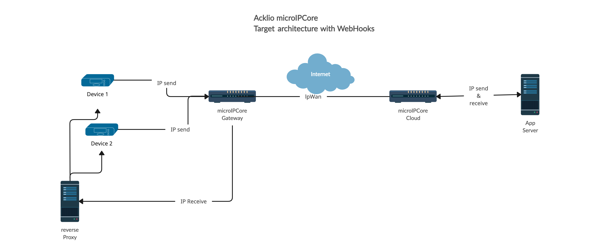
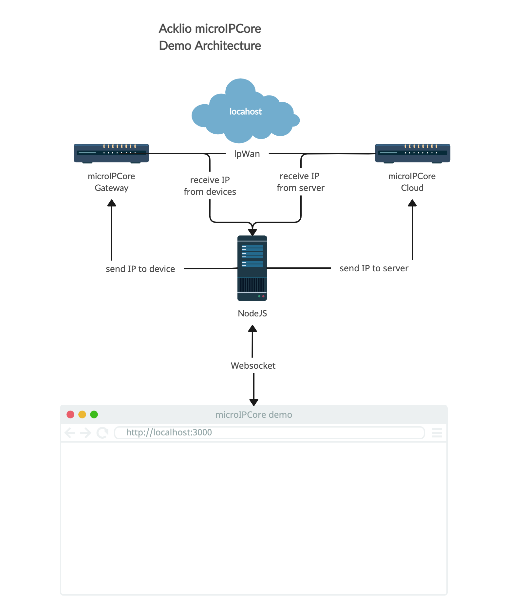

# Acklio microIPCore demo

## What is SCHC

SCHC is a compression and fragmentation framework tailored for LPWAN

[Read the complete description of what is SCHC on Acklio website](https://www.ackl.io/schc)

## How it works

Basically, microIPCore is a new brick of our software suite. It can replace the C SDK if microIPCore works as a gateway or it can replace the IPCore cloud if microIPCore works as a cloud server.

[Read how our software suite works](https://docs.acklio.cloud/docs/platform/overview)

## What is microIPCore

microIPCore is a subset of IPCore, our cloud implementation of SCHC. It can handle packets comming from 3 interfaces:

- IPv6
- WebHooks
- MQTT

It can be used in two ways:

### microIPCore as a gateway

The microIPCore will receive all the packets from the devices and will compress them based on compression templates. It will forward the compressed packets to an IPCore or to an another microIPCore.

### microIPCore as a server

The microIPCore will receive all the already compressed packets from any device with the SCHC SDK or from another microIPCore in gateway mode. It will decompress the packets based on compression templates and will forward them to an application server.

## What the purpose of the demo

This demo shows how to use two microIPCore linked by WebHooks connectors. The schema below shows a possible target architecture.



For the sake of the demo, we use a node server as a router / websocket server. The node server will receive the packets from the webpage and will forward them to the microIPCore. The microIPCore will compress the packets and will forward them to the other microIPCore. The second microIPCore will decompress the packets and will forward them to the node server. The node server will forward the packets back to the webpage.



## Run Locally

Clone the project

```bash
  git clone git@github.com:Acklio/micro-ipcore-demo.git
```

Go to the project directory

```bash
  cd micro-ipcore-demo
```

Install dependencies

```bash
  npm install

  or

  yarn i
```

Start the nodejs server

```bash
  npm run start

  or

  yarn start
```

For the microIPCore, you can launch the binary in the bin folder. The binary is built for linux x64 or Mac Os m1. Decompress the binary depending on your computer in the bin folder. More target will be available soon.

Start the microIPCore in Gateway mode

```bash
  ./bin/micro-ipcore webhook --config demo/webhook/config-device.json
```

You should see the following output:

```bash
Using config file: demo/webhook/config-device.json
INFO[0000] core-schc initialized                         mode=Device

 ┌───────────────────────────────────────────────────┐
 │                   Fiber v2.42.0                   │
 │               http://127.0.0.1:5683               │
 │                                                   │
 │ Handlers ............. 2  Processes ........... 1 │
 │ Prefork ....... Disabled  PID ............. 14141 │
 └───────────────────────────────────────────────────┘
```

Start the microIPCore in Server mode

```bash
  ./bin/micro-ipcore webhook --config demo/webhook/config-server.json
```

You should see the following output:

```bash
Using config file: demo/webhook/config-server.json
INFO[0000] core-schc initialized                         mode=Cloud

 ┌───────────────────────────────────────────────────┐
 │                   Fiber v2.42.0                   │
 │               http://127.0.0.1:5684               │
 │                                                   │
 │ Handlers ............. 2  Processes ........... 1 │
 │ Prefork ....... Disabled  PID ............. 14330 │
 └───────────────────────────────────────────────────┘
```

## Run in Docker

There's a docker-compose file in the demo folder. You can launch the demo with the following command:

```bash
  docker-compose up
```

Your microIPCore demo will be available on the 3000 port.

## Demo

Open your browser and go to http://localhost:3000

You should be able to send packets from devices to server and from server to devices.

If you open the developer console, you should see the logs of the two microIPCores.

Enjoy!

## Logs considerations

If you read the index.js file, you will see that we listen for all incoming udp messages on the 3001 port. This is a trick to be able to see the logs of the microIPCore. The microIPCore is not logging on the console but on the udp port 3001. So, we listen for all incoming udp messages on the 3001 port and we display them on the webpage thanks to the websocket.
